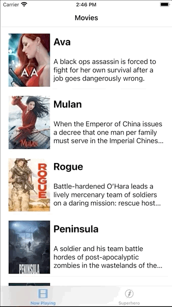
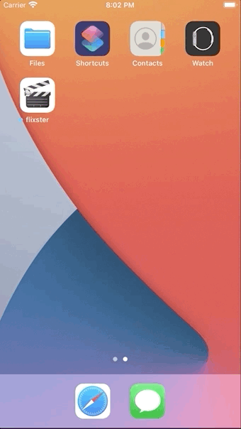
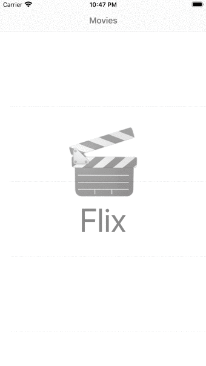

# Flix

Flix is an app that allows users to browse movies from the [The Movie Database API](http://docs.themoviedb.apiary.io/#).

## Flix Part 2

### User Stories

#### REQUIRED (10pts)
- [x] (5pts) User can tap a cell to see more details about a particular movie.
- [x] (5pts) User can tap a tab bar button to view a grid layout of Movie Posters using a CollectionView.

#### BONUS
- [x] (2pts) User can tap a poster in the collection view to see a detail screen of that movie.
- [ ] (2pts) In the detail view, when the user taps the poster, a new screen is presented modally where they can view the trailer.

### App Walkthrough GIFs
 
 
 
GIFs created with [GIPHY Capture](https://giphy.com/apps/giphycapture/)

### Notes
At first I had trouble getting the images to load in the grid layout but I had just forgoten to call `reloadData()` on the `CollectionView` after getting the list of movies.

---

## Flix Part 1

### User Stories

#### REQUIRED (10pts)
- [x] (2pts) User sees an app icon on the home screen and a styled launch screen.
- [x] (5pts) User can view and scroll through a list of movies now playing in theaters.
- [x] (3pts) User can view the movie poster image for each movie.

#### BONUS
- [ ] (2pt) User can view the app on various device sizes and orientations.
- [x] (1pt) Run your app on a real device.

### App Walkthrough GIFs
 
GIF created with [GIPHY Capture](https://giphy.com/apps/giphycapture/) 
 
GIF created with [Recordit](https://recordit.co/)

### Notes
I encountered a challenge loading the images because I was using HTTP instead of HTTPS. Xcode gave an error which I researched online and found a solution was to set `Allow Arbitrary Loads` to `YES` under `App Transport Security Settings` in `Info.plist`. This removed a security requirement Xcode had in place and worked to load the images, however, I later realized that there was no need to change the app settings as I hadn't copied the base URL correctly and I actually should have been using HTTPS.
 
In order to get the app to run on my iPhone which is on iOS 13.1, I had to lower the project's deployment target from 14.0. This did not cause a issue since the app is not using any features exclusive to iOS 14.0.
